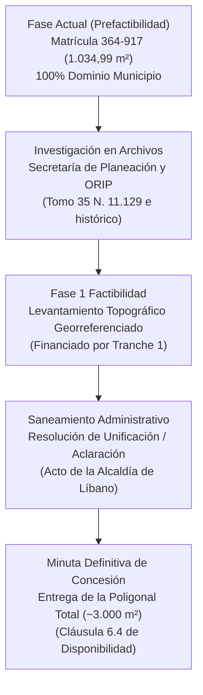

# Plan de Reconciliación de Cabida y Área Operativa
## Reconciliación entre Área Titulada (1.034,99 m²) y Huella Material (~3.000 m²)
### Planta de Beneficio Animal, Municipio de Líbano, Tolima
**Ecobank Development Colombia S.A.S. — Data Room Edition**  
*Septiembre 2026*

> [!WARNING]
> **Estado de verificación (revisión del 28 de septiembre de 2026):** la diferencia de cabida (~1.965 m²) está identificada pero **no está resuelta**. Los antecedentes de 1959 y 1979 constan únicamente en el certificado de tradición impreso el 28/08/2018; faltan las escrituras 935/1959 y 109/1979, el levantamiento georreferenciado y la ficha catastral. Las afirmaciones sobre la naturaleza jurídica del área adicional son **hipótesis de trabajo**.

---

## 1. Planteamiento de la Situación Predial

Al cotejar los títulos de propiedad inmobiliaria con los levantamientos de ingeniería de la planta, se identifica la siguiente situación física y registral:

* **Área Registrada en Folio:** La **Matrícula Inmobiliaria No. 364-917** delimita una cabida de **1.034,99 m²**, correspondiente al lote principal donde se asienta el edificio del matadero (según linderos de la Escritura No. 109 de 1979).
* **Huella Operativa Material:** El levantamiento técnico de redes de servicios (informe LOD 500) y la visita técnica de la Gobernación del Tolima (agosto de 2024) —ambos referenciados aquí, pero no incluidos en esta sala de datos— indican que la infraestructura integral de la planta —incluyendo corrales de recepción y pesaje, rampa de desembarque, báscula camionera, planta de tratamiento de aguas residuales (PTAR), biodigestor anaeróbico *(por confirmar si existen hoy o corresponden a las obras proyectadas en el CapEx; ver teaser)*, zona de amortiguamiento ambiental y vías internas de circulación— ocupa un polígono continuo cercado de aproximadamente **~3.000 m²**.

---

## 2. Diagnóstico Jurídico y Pista Histórica ("Keep Digging")

Esta discrepancia entre área registrada y huella construida es un fenómeno común en activos de infraestructura pública municipal construidos en las décadas de 1960 a 1980 en Colombia.

La investigación de títulos realizada sobre la Matrícula 364-917 arrojó una pista registral fundamental:
> *«CON BASE EN LAS SIGUIENTES MATRICULAS: TOMO 35 N. 11.129»*

1. **Predio de Origen (1959):**  
   El Municipio del Líbano adquirió en 1959 un predio a la señora Emelina Gálvez Vda. de Millán (Escritura 935 del 23/09/1959, registrada en el **Tomo 35 N. 11.129**). El certificado de tradición no indica la extensión total de ese predio. *Hipótesis de trabajo (por verificar con las escrituras 935/1959 y 109/1979):* al constituir EMPOLÍBANO LTDA en 1979 (Escritura 109) se aportó solo el lote del edificio (1.034,99 m²), y las zonas aledañas de corrales y servicios habrían permanecido en el dominio municipal como bien fiscal o mayor extensión no desenglobada.
2. **Desarrollo Urbano San Antonio:**  
   Según el folio, el predio está situado en la Urbanización San Antonio. *Hipótesis por verificar:* el suelo contiguo (accesos y talud de protección ambiental) correspondería a cesiones obligatorias públicas o bienes fiscales del Municipio; no hay título ni certificación en esta sala que lo acredite.

---

## 3. Hoja de Ruta para Factibilidad y Cierre Contractual

La reconciliación de cabida no bloquea la prefactibilidad y cuenta con una ruta técnica y legal definida para la etapa de Factibilidad (conforme al Decreto 1082 de 2015, Art. 2.2.2.1.5.5 núm. 2.6):

1. **Paso 1 — Investigación Registral y Catastral Activa:**  
   **Pendiente:** solicitar ante la ORIP del Líbano y la Secretaría de Planeación la búsqueda en los libros del antiguo sistema sobre el **Tomo 35 N. 11.129** para certificar la cabida total de la compraventa municipal de 1959. *(El soporte de esa radicación no está en esta sala; el oficio AL-RS-2026-00005653 solo remite a Planeación la identificación de la ficha catastral.)*
2. **Paso 2 — Levantamiento Georreferenciado (Factibilidad - Fase 1):**  
   Financiado con los recursos de la ronda de capital inicial (Tranche 1), se realizará un levantamiento topográfico de precisión con coordenadas MAGNA-SIRGAS que determine la poligonal exacta de ocupación actual (~3.000 m²).
3. **Paso 3 — Acto Administrativo de Saneamiento y Delimitación:**  
   Con base en el levantamiento, la Alcaldía Municipal expedirá el acto administrativo de alinderamiento, aclaración o unificación de cabida predial previo a la firma del contrato.
4. **Blindaje Contractual:**  
   La Cláusula 6.4 del borrador de contrato de concesión establece la **Obligación de Disponibilidad Material y Jurídica** y remite expresamente a este Plan: el Municipio garantiza la entrega del predio libre de ocupaciones precarias, servidumbres incompatibles no declaradas y pasivos ambientales no revelados. El riesgo de saneamiento predial (R-08 en la Matriz CONPES 3714) figura como Público/Compartido. *Observación:* la cláusula no menciona expresamente la entrega de la poligonal total (~3.000 m²) ni el saneamiento de la cabida; se recomienda incluirlo en la minuta definitiva.
